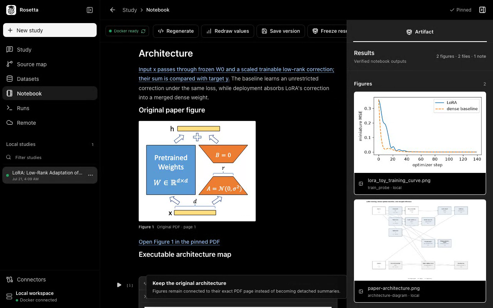
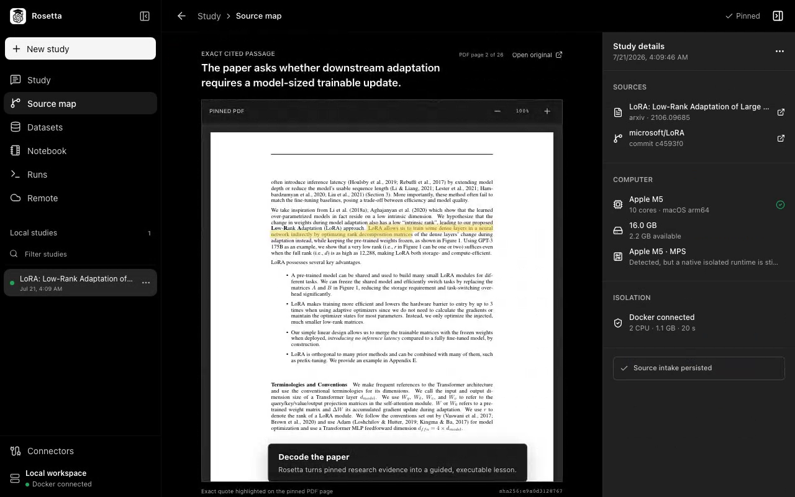
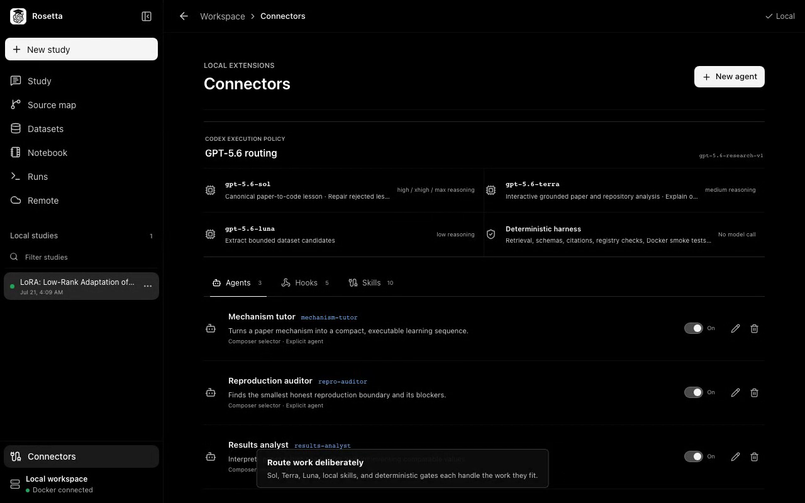
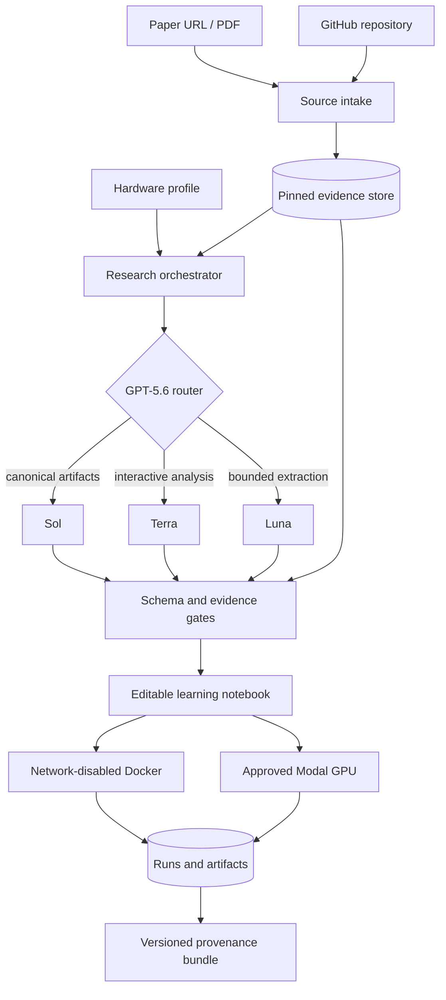

<p align="center">
  
</p>

<h1 align="center">Rosetta</h1>

<p align="center">
  <strong>Decode papers. Adapt experiments. Learn by running them anywhere.</strong>
</p>

<p align="center">
  Turn a machine-learning paper and its repository into an evidence-linked lesson with experiments sized for your hardware.
</p>

<p align="center">
  <a href="https://github.com/yc9954/rosetta/actions/workflows/quality.yml"></a>
  <a href="LICENSE"></a>
  
  
</p>

<p align="center">
  <a href="https://github.com/yc9954/rosetta/archive/refs/heads/main.zip"><strong>Download source</strong></a>
  · <a href="#install-and-run">Setup</a>
  · <a href="#try-the-lora-sample">LoRA sample</a>
</p>

<p align="center">
  
</p>

<p align="center"><sub>From a cited claim to its PDF evidence, executable lesson, retained results, and model route.</sub></p>

Rosetta is a local-first learning workbench for AI engineers. It reads a paper and its pinned implementation, identifies the ideas a learner must understand, and turns those ideas into small experiments that can run on the learner's computer or an approved Modal GPU. It does not claim that a laptop-sized demonstration reproduces a paper's full benchmark. Instead, it keeps four kinds of evidence separate:

1. what the paper reports;
2. what the pinned repository implements;
3. what was changed to fit the available hardware; and
4. what this machine or an approved Modal GPU actually executed.

The result is a compact notebook designed to teach the paper's thesis, definitions, equations, architecture, training behavior, inference path, limitations, and transferable lessons without requiring the reader to reconstruct that story from a raw PDF and a large repository.

## What it does

- **Pins the sources.** Downloads a bounded PDF, extracts page-level text, hashes it, and pins a public GitHub repository to a commit without executing repository setup code.
- **Reads the machine.** Records CPU, memory, disk, detected accelerators, Docker availability, and an explicit local execution budget.
- **Adapts rather than imitates.** Preserves the mechanism, loss, metrics, freezing behavior, and evaluation meaning while reducing only scale dimensions such as rows, batch size, width, layers, steps, and rank.
- **Builds a learning notebook.** Produces structured prose, KaTeX equations, architecture figures, editable CodeMirror cells, predictions, executable probes, observations, and paper-to-code mappings.
- **Executes with back-pressure.** Runs cumulative cells in a network-disabled, read-only Docker environment and gives real stderr to a narrowly scoped repair pass.
- **Uses remote compute deliberately.** Creates a Modal plan, chooses the smallest compatible allowlisted GPU, shows the maximum GPU-only cost, and requires one-time approval before launch.
- **Keeps provenance.** Retains source hashes, model route, reasoning effort, prompt hash, notebook versions, code hash, image digest, run lineage, outputs, figures, annotations, and deviations.

## How Rosetta teaches a paper

Each notebook follows a deliberate learning sequence rather than presenting a summary followed by unrelated code:

1. **Orient.** State the paper's central question, thesis, prerequisites, and paper-defined terms in the order needed to read the method.
2. **Trace.** Connect each important equation and architectural component to the exact PDF passage and pinned repository symbol that implements it.
3. **Predict.** Ask what should happen before execution, including expected invariants, failure modes, and values that should change or remain frozen.
4. **Run.** Execute the smallest experiment that preserves the mechanism, loss, optimization path, inference behavior, and meaningful comparison.
5. **Interpret.** Place observations beside the code and figures, separating what the run establishes from what the original paper reports.
6. **Transfer.** Finish with a mental model, appropriate use cases, limitations, and a scale-up checklist for moving toward the reported experiment.

<p align="center">
  
</p>

<table>
  <tr>
    <td width="50%"></td>
    <td width="50%"></td>
  </tr>
  <tr>
    <td><strong>Evidence that opens at the source</strong><br/>A claim links to the pinned PDF page and highlights the closest exact passage.</td>
    <td><strong>Routing that is inspectable</strong><br/>The active model policy is visible in the app and recorded with every model-backed result.</td>
  </tr>
</table>

## Try the LoRA sample

The sample uses public inputs and exercises the full paper-to-notebook path:

| Input | Value |
| --- | --- |
| Paper | `https://arxiv.org/abs/2106.09685` |
| Repository | `https://github.com/microsoft/LoRA` |
| Goal | Understand low-rank updates, frozen weights, training, and merged inference on the current hardware |

The same values are retained in [`examples/lora-study.json`](examples/lora-study.json). In the app, select **New study**, paste the paper and repository URLs, then select **Start inspection**. After the sources are pinned, open **Notebook** and select **Build notebook**.

Expected output is a concept reproduction, not the paper's full GPT-3/RoBERTa benchmark: a small trainable low-rank correction, a dense baseline, explicit base-weight freezing checks, a real optimization loop, merged-inference equivalence, an architecture map, generated metrics, and a written boundary explaining what the demo does not establish.

## Install and run

### Prerequisites

| Requirement | Used for | Required? |
| --- | --- | --- |
| Node.js 22+ and npm | Source development | Yes |
| Codex CLI with ChatGPT sign-in or `CODEX_API_KEY` | Chat, notebook, figure, and dataset agents | Yes for model-backed work |
| Docker Desktop / Engine | Isolated local notebook execution | Optional but recommended |
| Python 3 + Modal token | Approved remote GPU execution | Optional |

```bash
git clone https://github.com/yc9954/rosetta.git
cd rosetta
npm ci
npm run dev
```

Open `http://127.0.0.1:4173`. The desktop onboarding can start `codex login`, or authenticate first:

```bash
codex login
```

Build the pinned local runner before executing notebook cells:

```bash
npm run runtime:build
npm run runtime:smoke
```

Source inspection works without Docker. A missing Codex login blocks model-backed stages but does not block source inspection. A missing Modal connection blocks only remote execution.

### Desktop build

```bash
npm run desktop:package
npm run desktop:smoke:packaged
npm run desktop:dist
```

The Electron bundle includes the application runtime; end users do not need Node.js to launch a packaged build. Public macOS distribution still requires Developer ID signing and notarization. Build Windows and Linux targets on their native operating systems.

## Architecture



### Trust boundaries

| Boundary | Contract |
| --- | --- |
| Remote paper and repository | Treated as untrusted evidence, never as instructions; repository setup is not executed. |
| Model output | Must pass strict JSON, citation, curriculum, code-lifecycle, and resource-adaptation validation. |
| Local execution | Loopback-only API, allowlisted image, no network, read-only root, dropped capabilities, bounded CPU/RAM/PIDs/time. |
| Modal execution | Separate plan, package allowlist, GPU choice and cost bound, expiring one-time approval, no automatic paid retry. |
| Artifact | Built only from verified local manifests or matching retained Modal runs; hashes and deviations remain visible. |

More detail is available in [`docs/research-learning-agent-architecture.md`](docs/research-learning-agent-architecture.md) and [`docs/numeric-analysis-architecture.md`](docs/numeric-analysis-architecture.md).

## GPT-5.6 model routing

The system does not send every request to the largest model at maximum reasoning. Routing is a versioned execution policy, `gpt-5.6-research-v1`, enforced with explicit `codex exec --model` and reasoning settings.

| Workload | Route | Why |
| --- | --- | --- |
| Notebook authoring | `gpt-5.6-sol` / `high` | Paper-wide scientific synthesis and executable code become the canonical learning artifact. |
| Structure repair | `gpt-5.6-sol` / `xhigh` | Used only after deterministic grounding, schema, or curriculum validation rejects the draft. |
| Runtime repair | `gpt-5.6-sol` / `max` | Reserved for observed Docker stderr or an unsafe autograd warning. |
| Figure reconstruction | `gpt-5.6-sol` / `high` | High-fidelity scientific structure is required before exact numeric verification. |
| Research chat | `gpt-5.6-terra` / `medium` | Balances grounded reasoning and latency for iterative questions. |
| Cell explanation/edit | `gpt-5.6-terra` / `medium` | The selected cell, output, and annotation tightly bound the task. |
| Dataset extraction | `gpt-5.6-luna` / `low` | Generates candidates quickly; live registry, license, size, and hardware checks remain authoritative. |

This follows OpenAI's [GPT-5.6 model guidance](https://developers.openai.com/api/docs/guides/latest-model): reserve the flagship and higher reasoning for measured quality needs, use the balanced model for interactive work, and use the fastest model for bounded high-volume work. OpenAI also identifies coding, science, long-horizon agentic work, experimental diagnosis, and result interpretation as GPT-5.6 strengths in the [GPT-5.6 launch](https://openai.com/index/gpt-5-6/).

Every call records the actual model, family, workload, effort, policy version, duration, Codex CLI version, authentication mode, and prompt SHA-256. Model aliases can be pinned without code changes:

```bash
export ROSETTA_MODEL_SOL=gpt-5.6-sol
export ROSETTA_MODEL_TERRA=gpt-5.6-terra
export ROSETTA_MODEL_LUNA=gpt-5.6-luna
```

The configured ChatGPT or API account must have access to those models. No credential is committed to this repository.

## Where Codex accelerated the workflow

Codex was used both to build the product and as the product's local research runtime.

### During development

- Audited the application function by function after real UI failures instead of patching screenshots in isolation.
- Converted repeated review feedback into repository-wide contracts for PDF rendering, math normalization, source citations, annotation positioning, dataset navigation, Modal cancellation, and artifact retention.
- Implemented and repeatedly ran a back-pressure loop: ESLint, TypeScript, unit contracts, production build, Electron smoke, preview budget, desktop/mobile Playwright, and Docker execution.
- Diagnosed the packaged Electron-only `remark-parse` interop failure, fixed the CommonJS boundary, and strengthened the desktop smoke to perform a real LoRA paper/repository intake.
- Used screenshots and a short product tour as verification evidence while keeping only representative public media in this repository.

### Inside the product

- Codex receives the pinned paper pages, repository snapshot, hardware plan, enabled local skills/hooks, and a strict output contract.
- Codex creates or repairs the semantic artifact; deterministic code decides whether the result is admissible.
- Failed validation is evidence for a specific escalation route, not permission to weaken the validator.
- Interactive chat and cell annotations use the same evidence boundary as notebook generation, so edits remain tied to the source and observed runs.

This division was a core decision: the model handles synthesis, explanation, and repair; code handles identity, authorization, limits, execution, and proof.

## Key technical decisions

1. **Teach the mechanism, do not fake the benchmark.** The app scales experiments to the available hardware and labels deviations instead of presenting a toy result as paper reproduction.
2. **Separate reported from reproduced.** Paper metrics are citations until an execution manifest proves that this app produced them.
3. **Escalate reasoning after failure.** `max` reasoning is a repair tool triggered by concrete runtime evidence, not a default.
4. **Make remote spend an explicit action.** Modal planning is local; launch requires a visible plan and one-time user approval.
5. **Preserve the path, not only the answer.** Sources, prompts, model route, notebook versions, runs, figures, comments, and artifacts form a recoverable lineage.
6. **Fail closed at workflow gates.** A study cannot advance when its minimum source, saved-notebook, runtime, or approval state is missing.

## Modal GPU execution

Open **Remote**, enter a Modal Token ID and Secret from `https://modal.com/settings/tokens`, and verify the connection. Credentials can remain in memory for the session or be stored in the app-isolated profile with owner-only permissions. They are excluded from studies, logs, artifacts, and provenance.

The app selects the lowest-rate compatible allowlisted GPU from the notebook's declared memory and dtype/kernel requirements. Before a run it shows packages, selected GPU, selection reason, timeout, network policy, and maximum GPU-only cost. Paid runs are never retried automatically.

For an automated environment:

```bash
export MODAL_TOKEN_ID=...
export MODAL_TOKEN_SECRET=...
npm run modal:smoke
```

## Verification

```bash
# Portable gate: lint, 50 unit tests, skill contracts, types,
# production build, Electron intake smoke, preview smoke, Playwright
npm run verify

# Includes Docker image build and runtime smoke
npm run quality:loop -- --profile=full --max=2

# Explicitly consumes Codex quota; does not launch Modal
npm run test:agent-live
```

The harness stops at the first failing stage and writes a machine-readable report under `.rosetta/harness/`. Playwright audits desktop and mobile navigation, overflow, accessible names, dialogs, failure recovery, source highlighting, KaTeX, generated figures, syntax editing, annotations, artifacts, and remote approval.

## Project layout

```text
electron/      Packaged desktop process, preload, and embedded API
scripts/       Source intake, agent orchestration, runners, packaging, harness
src/           React workbench and shared contracts
runtime/       Pinned network-disabled Python/PyTorch image
skills/        Versioned paper, dataset, figure, execution, and provenance skills
tests/         Unit, API, desktop/mobile Playwright, preview, and live-agent gates
docs/          Architecture and research-method notes
examples/      Public sample study inputs
```

## Current limits

- A compact notebook is educational evidence, not a substitute for the paper's original training budget, private data, or full benchmark protocol.
- Host accelerator detection does not prove the local PyTorch image can use that accelerator; the default Docker runner is intentionally CPU-only.
- Public macOS installers require signing and notarization; the local DMG build is not a public release artifact.
- Model availability depends on the user's Codex authentication and plan.
- Modal cost estimates cover the selected GPU for the bounded timeout, not taxes, storage, or future pricing changes.

## License

[MIT](LICENSE)
